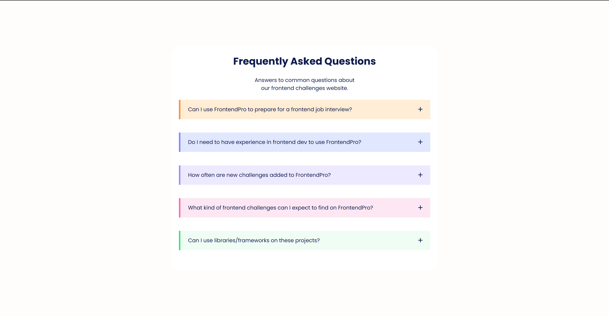

# Accordion Component

This is a frontend challenge from [FrontendPro](https://www.frontendpro.dev) to build an interactive FAQ accordion component using HTML, CSS, and JavaScript. The component is designed to display questions and answers in a visually appealing accordion style, allowing users to expand and collapse answers by clicking on the questions.

## Project Overview

The Accordion Component is a user interface (UI) element commonly used in web design to display a list of items, where each item can be expanded to reveal more details. This particular implementation of an accordion follows a FAQ (Frequently Asked Questions) style layout, with smooth transitions and individual item color customization.

### Features
- **Expandable/Collapsible Items**: Users can click on any question to reveal or hide the answer.
- **Smooth Transitions**: The accordion utilizes CSS transitions for smooth opening and closing effects.
- **Icon Toggle**: Each question has a plus icon (`+`) that switches to a times icon (`x`) when expanded.
- **Color-coded Items**: Each FAQ item has a unique color scheme, making the layout visually engaging.

## Technologies Used
- **HTML**
- **CSS** (with custom styles and responsive design adjustments)
- **JavaScript** (for handling click events and toggling the accordion state)
- **Google Fonts** (Poppins font)
- **Font Awesome** (for icons)

## Getting Started

### Prerequisites
- Basic knowledge of HTML, CSS, and JavaScript.
- A code editor like Visual Studio Code.
- Internet connection (to load Font Awesome and Google Fonts in the project).

### Installation

1. **Clone the repository:**
   ```bash
   git clone https://gitlab.com/Yashi-Singh-9/accordion-component.git
   ```

2. **Navigate into the project directory:**
   ```bash
   cd accordion-component
   ```

3. **Open `index.html` in your browser to view the project.**

## Folder Structure

```
accordion-component/
├── index.html       # Main HTML file
├── style.css        # CSS file for styling the accordion
├── script.js        # JavaScript file for accordion functionality
└── README.md        # Documentation for the project
```

## How It Works

1. **HTML Structure**: 
   Each question-answer pair is enclosed in a `.accordion-item` div, with the question in `.accordion-header` and the answer in `.accordion-content`.

2. **CSS Styling**:
   - Color schemes are applied to individual items using `nth-child` selectors for a visually pleasing look.
   - Transitions for smooth opening and closing animations are applied using `max-height` and `opacity` properties.
   - Responsive styling is added for smaller screens.

3. **JavaScript Functionality**:
   - Each question (`.accordion-header`) is clickable. When clicked, the associated answer (`.accordion-content`) expands, while any previously opened answer collapses.
   - Icons toggle between a plus (`+`) and a times (`x`) symbol to indicate open/close status.

## Usage

Simply open the `index.html` file in your preferred web browser. Clicking on each question will expand or collapse the answer, with smooth transitions and icon toggling.

## Customization

- **Colors**: Adjust the colors in `style.css` for `.accordion-item:nth-child(n)` to customize the look of each item.
- **Icons**: You can change the icons in `index.html` or use different Font Awesome icons by editing the `fa-plus` and `fa-times` classes in the JavaScript file.
- **Content**: Modify the questions and answers in `index.html` to fit your specific FAQ content.

## Screenshot



## License
This project is open-source and available under the MIT License.
